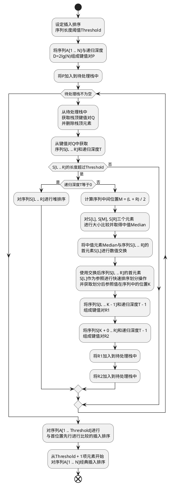

```puml
@startuml
start
:设定插入排序
序列长度阈值Threshold;
:将序列A[1 .. N]与递归深度
D=2lg(N)组成键值对P;
:将P加入到待处理栈中;
while (待处理栈不为空)
    :从待处理栈中
    获取栈顶键值对Q
    并删除栈顶元素;
    :从键值对Q中获取
    序列S[L .. R]和递归深度T;
    if(S[L .. R]的长度超过Threshold) then (是)
        if(递归深度T等于0) then (是)
            :对序列S[L .. R]进行堆排序;
        else (否)
            :计算序列中间位置M = (L + R) / 2;
            :对S[L], S[M], S[R]三个元素
            进行大小比较并取得中值Median;
            :将中值元素Median与序列S[L .. R]的
            首元素S[L]进行数值交换;
            :使用交换后序列S[L .. R]的首元素
            S[L]作为参照进行快速排序划分操作
            并获取划分后参照值在序列中的位置K;
            :将序列S[L .. K - 1]和递归深度T - 1
            组成键值对R1;
            :将序列S[K + 0 .. R]和递归深度T - 1
            组成键值对R2;
            :将R1加入到待处理栈中;
            :将R2加入到待处理栈中;
        endif
    else (否)
    endif
endwhile
:对序列A[1 .. Threshold]进行
与首位置先行进行比较的插入排序;
:从Threshold + 1项元素开始
对序列A[1 .. N]经典插入排序;
end
@enduml
```