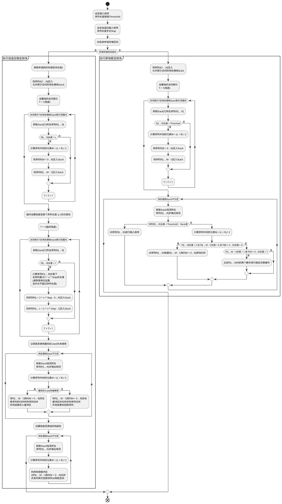

```puml
@startuml
start

:设定插入排序
序列长度阈值Threshold;

:设定自适应插入排序
序列长度步长Step;

:向系统申请存储空间;

if(申请存储空间成功) then(是)
partition 执行自适应稳定排序 {
    :获取申请到的存储空间长度L;
    :将序列A[1 .. N]压入
    允许索引访问的待处理栈Stack;

    :设置栈的访问索引
    T = 1(栈底);

    while(访问索引T在待处理栈Stack索引范围内)
        :获取Stack[T]所在序列P[L .. R];
        if(P[L .. R]长度 > L) then(是)
            :计算序列中间的元素M = (L + R) / 2;
            :将序列P[M + 0 .. R]压入Stack;
            :将序列P[L .. M - 1]压入Stack;
        else(否)
        endif
        :T = T + 1;
    endwhile

    :临时设置栈底至首个序列长度 ≤ L的元素处;
    :T = 1(临时栈底);
    while(访问索引T在待处理栈Stack索引范围内)
        :获取Stack[T]所在序列P[L .. R];
        if(P[L .. R]长度 > 1) then(是)
            :计算序列P[L .. R]长度下
            支持的最大2 ^ n * Step的长度
            (通常使用位运算, 
            且步长不超过序列长度);
            :将序列P[L + 2 ^ n * Step - 0 .. R]压入Stack;
            :将序列P[L .. L + 2 ^ n * Step - 1]压入Stack;
        else(否)
        endif
        :T = T + 1;
    endwhile

    :记录是否使用缓存区Used为未使用;
    while(待处理栈Stack不为空)
        :获取Stack栈顶所在
        序列P[L .. R]并弹出栈顶;
        :计算序列中间的元素M = (L + R) / 2;
        if(缓存区Used未被使用) then(是)
            :将P[L .. M - 1]和P[M + 0 .. R]存在
            原序列的归并好的序列归并
            并将结果存入缓冲区;
        else(否)
            :将P[L .. M - 1]和P[M + 0 .. R]存在
            缓冲区的归并好的序列归并
            并将结果存回原序列;
        endif
    endwhile

    :设置栈底至原始的栈底处;
    while(待处理栈Stack不为空)
        :获取Stack栈顶所在
        序列P[L .. R]并弹出栈顶;
        :计算序列中间的元素M = (L + R) / 2;
        :利用有限缓冲区
        对P[L .. M - 1]和P[M + 0 .. R]归并
        并及时拷贝回原序列以释放空间;
    endwhile
}
else(否)
partition 执行原地稳定排序 {
    :将序列A[1 .. N]压入
    允许索引访问的待处理栈Stack;

    :设置栈的访问索引
    T = 1(栈底);

    while(访问索引T在待处理栈Stack索引范围内)
        :获取Stack[T]所在序列P[L .. R];
        if(P[L .. R]长度 > Threshold) then(是)
            :计算序列中间的元素M = (L + R) / 2;
            :将序列P[M + 0 .. R]压入Stack;
            :将序列P[L .. M - 1]压入Stack;
        else(否)
        endif
        :T = T + 1;
    endwhile

    while(待处理栈Stack不为空)
        :获取Stack栈顶所在
        序列P[L .. R]并弹出栈顶;
        if(序列P[L .. R]长度 < Threshold） then(是)
            :对序列P[L .. R]进行插入排序;
        else(否)
            :计算序列中间的元素M = (L + R) / 2;
            if(P[L .. R]长度 > 2 且 P[L .. M - 1]长度 > 0 且 P[M + 0 .. R]长度 > 0) then(是)
                :对序列P[L .. R]依据P[L .. M - 1]和P[M + 0 .. R]原地归并;
            else(否)
                if(P[L .. M - 1]长度 = 1 或 P[M + 0 .. R]长度 = 1) then(是)
                    :比较P[L .. R]内的两个数并进行相应交换操作;
                else(否)
                endif
            endif
        endif
    endwhile
}
endif
end
@enduml
```